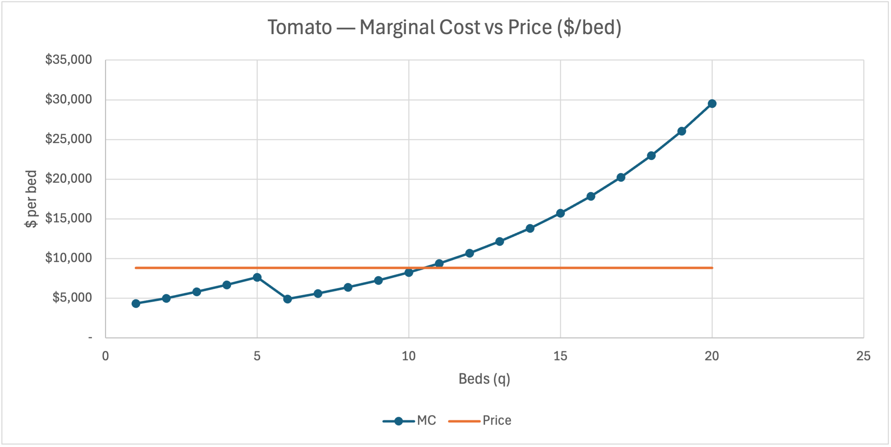
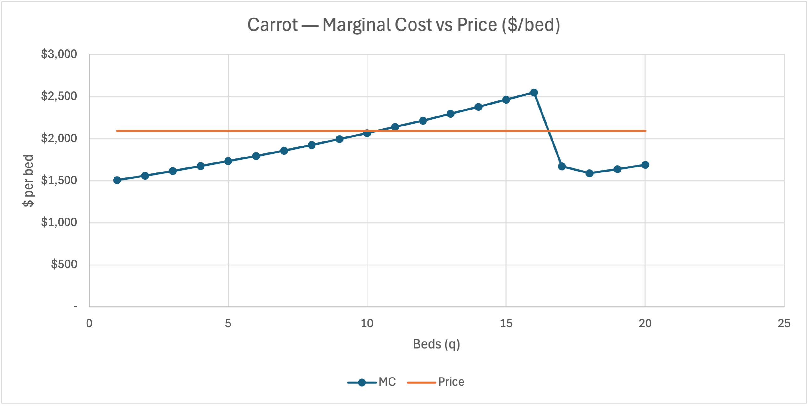
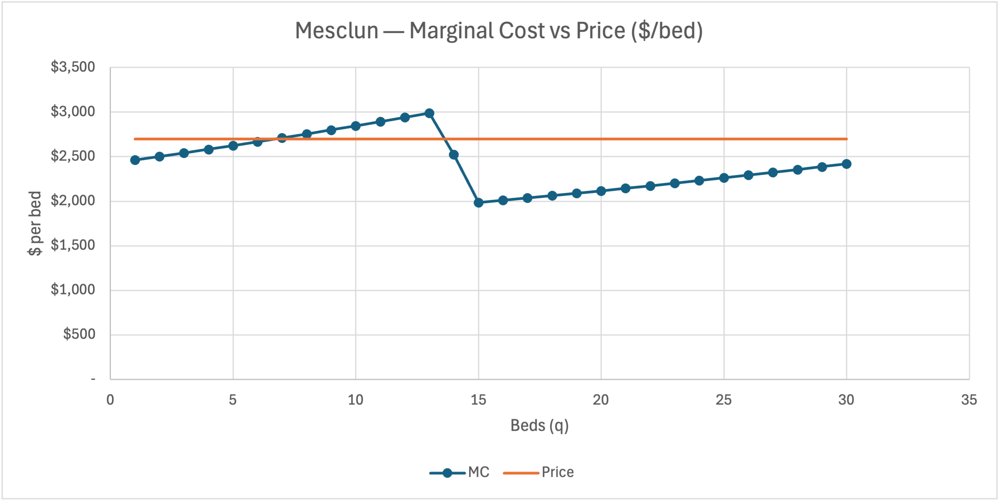

# Perfect Competition Analysis

## Optimal planting plan

The optimized planting plan is 10 beds of tomatoes, 20 beds of carrots, and 30 beds of mesclun. I used 60 of the farm’s available 64 beds and produced a season profit of $42,761. I had 4 unused beds, so the physical space is not the constraint that determines the final crop mix. The tomatoes stop because their marginal cost (MC) eventually exceeds the price, while carrots and mesclun stop because their crop-specific caps prevented me from planting any more.

## Why tomatoes stop at 10 beds

Tomatoes had the highest price per bed at $8,800. The high revenue from an additional bed is not just about going for the highest-priced bed; the decision is whether the next bed adds revenue greater than its MC.

The 10th tomato bed remains profitable because its MC is $8,248.59, which is below the $8,800 cut-off. The 11th bed does not meet the test, and its MC is approximately $9,400, or almost $600 above price. The model stops at 10 beds because bed 10 is the last tomato bed where marginal revenue exceeds MC.

Figure 1 shows the tomato MC schedule crossing the price line between beds 10 and 11.

The four unused beds reflect that additional tomato output is no longer profitable at the margin.

## Binding constraints and expansion value

The carrot and mesclun crop caps are the binding constraints. I planted all 20 permitted carrot beds and all 30 permitted mesclun beds. In contrast, the total-bed limit is slack at 60 of 64 beds, the tomato cap is slack at 10 of 20 beds, and temporary-worker capacity is slack at about 3.16 of the four available workers.

The shadow price of one additional carrot bed, meaning relaxing a binding constraint by one unit while I hold the rest of the model’s assumptions constant, is about $352.49, while the shadow price of one additional mesclun bed is about $246.47. These are local values. If the farm can relax only one production limit, it should seek one additional carrot bed first because that constraint has the larger marginal value. The farm does not need more land to house that capacity because four beds are already unused.

The crop caps stop production before the marginal economics do. At bed 20, carrot MC is $1,688.95, which remains $405.05 below the $2,094 carrot price. At bed 30, mesclun MC is $2,420.10, still $279.90 below the $2,700 mesclun price. Each next unit remains profitable, but the farm is prevented from adding it by the production caps.

Figure 2 shows carrot MC remains below price at the 20-bed cap.

Figure 3 shows mesclun MC remains below its $2,700 price through the 30-bed cap.

This supports the shadow-price result and distinguishes a binding policy or production cap from an economic stopping point such as the tomato crossing.

## Why marginal cost dips across crops

The marginal-cost schedules for tomatoes, carrots, and mesclun each decline when production crosses the farmer’s 720 available field hours. These are the validated, mix-independent standalone schedules required by the specification and cross-checked by the Farm Profit Lab; they are not drawn from the untested per-crop block in `Mix!B27:E28`.

The same labor-pricing mechanism causes every dip. Marginal cost equals the rising incremental labor requirement multiplied by the applicable blended wage, plus fertilizer cost. Although the incremental labor requirement rises with each additional bed, the marginal labor wage falls sharply once the farmer’s 720 hours are exhausted: farmer labor costs $34.7222 per hour, while temporary labor costs $17.3611 per hour. The position of the 720-hour threshold within the crossing bed determines whether the MC decline appears over one bed or two.

| Crop | Last bed under 720 hours | First bed above 720 hours | Marginal-cost dip |
|---|---:|---:|---|
| Tomatoes | Bed 4: 527.076 hours | Bed 5: 724.730 hours | Bed 6 |
| Carrots | Bed 16: 712.563 hours | Bed 17: 776.025 hours | Beds 17 and 18 |
| Mesclun | Bed 13: 687.529 hours | Bed 14: 749.671 hours | Beds 14 and 15 |

For tomatoes, bed 5 adds 197.654 labor hours, but 192.924 of those hours, or 97.6 percent, are still supplied by the farmer. Only 4.730 hours are temporary labor, leaving a blended wage of $34.31 per hour. Consequently, tomato MC continues to rise to $7,660.86 at bed 5. Bed 6 is supplied entirely by temporary workers, causing MC to fall to $4,906.28 before rising again thereafter.

The carrot and mesclun crossings occur earlier within their respective crossing beds. Carrot bed 17 requires 63.463 additional hours, of which 56.025 hours, or 88.3 percent, are temporary labor. Its blended wage falls to $19.40 per hour, and MC declines to $1,670.90 at bed 17; bed 18 is fully temporary-labor priced and falls further to $1,589.14. Mesclun bed 14 requires 62.142 additional hours, split between 32.471 farmer hours and 29.671 temporary hours. The resulting blended rate is $26.43 per hour, reducing MC to $2,522.58; bed 15 is entirely temporary-labor priced and falls further to $1,983.96.

After the next fully temporary-labor-priced bed, MC rises monotonically again for all three crops because the incremental labor requirement continues to increase. The dip is therefore due to a transition in labor force, not evidence against diminishing returns in the physical production process.

## Standalone losses and shutdown logic

The workbook does not fully support the assignment’s statement that every crop loses money alone or that price exceeds Average Variable Cost (AVC) at every quantity. A negative standalone total profit can reflect fixed costs rather than a short-run reason to shut down. If price exceeds AVC, production covers its avoidable costs and contributes toward fixed costs even when total profit remains negative.

For example, carrots lose $16,488.92 at 20 beds under the workbook’s standalone treatment, but their beds still cover their labor, fertilizer, and other variable costs. Mesclun’s result is more qualified: its AVC exceeds the $2,700 price at beds 13 and 14, so it does not satisfy the simplified claim that price exceeds AVC at every output. Tomatoes are not a “grow at a loss” crop; they are profitable on a standalone basis from 7 through 13 beds and reach maximum standalone profit of $6,172.77 at 10 beds. Tomato production stops at 10 because the next bed’s MC exceeds price, not because it fails the shutdown test.

## Comparison with Stage 1

My Stage 1 reasoning reached the correct overall conclusion about the optimized plan, but the later analysis showed that my test of that conclusion was too coarse. I wrote that if the model filled every bed or exhausted the labor budget, then land or labor—not marginal economics—would be what stopped the farm. Aggregate labor remains slack: the optimized plan uses 5,277 of 6,480 available labor hours. On that aggregate measure, the falsification test passed. However, the farmer’s 720 available field hours are fully exhausted, and that lower-level constraint is the mechanism behind every marginal-cost dip discussed under “Why marginal cost dips across crops.” My original test could detect exhaustion of the total labor budget, but it could not detect the specific labor allocation that ultimately mattered.

The earlier reference to approximately 5,277 labor hours was a published check figure rather than an independently generated prediction, so matching it should not be treated as confirmation of a forecast. The more useful finding is that aggregate slack can conceal a binding operational constraint: the farmer supplies all 720 available field hours, while temporary workers supply the remaining 4,557 of the plan’s 5,277 total labor hours.

My Stage 1 description also implied that crop labor and cost would rise smoothly as more beds were planted. The final schedules support the tomato stopping point at 10 beds because MC exceeds price on bed 11, but they contradict the implied smooth path: tomato MC falls at bed 6, and carrot and mesclun MC each show a two-bed decline at their farmer-to-temporary-labor transition. That section shows that these different shapes arise from the same mechanism rather than from different production processes.

The parts of the Stage 1 reasoning that were independent of the published check figures held up. The elimination argument—that the farm is not stopped by total land or aggregate labor capacity, but by marginal economics and crop-specific limits—remains supported by the optimized results. Likewise, the four unused beds are idle for economic rather than physical reasons: the next tomato bed has MC of $9,390.72, exceeding its $8,800 price by $590.72, while the carrot and mesclun caps bind before the total-bed constraint does.

Two Stage 1 claims require qualification. Neither carrots nor mesclun are marginally profitable across their entire ranges: carrot MC exceeds its $2,094 price from beds 11 through 16, while mesclun MC exceeds its $2,700 price from beds 7 through 13. In each case, the labor transition brings MC back below price before the crop reaches its cap. Mesclun also does not satisfy the simplified statement that price exceeds AVC at every quantity, because its AVC exceeds price at beds 13 and 14. The final analysis therefore confirms the core conclusion while showing that the original explanation was incomplete and required bed-level verification.

---

_Structural review with Claude (2026-08-30) and marginal-cost recomputation (2026-09-03); the model applied spelling and formatting fixes and supplied the labor-tier decomposition behind the dip table, all prose is mine. See [prompt-log.md](../prompt-log.md)._
